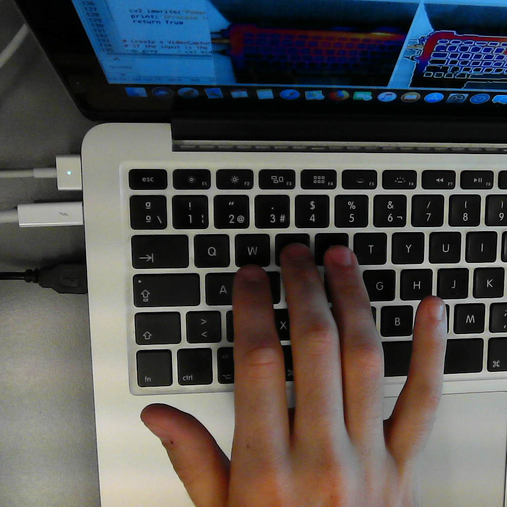
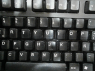
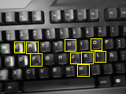
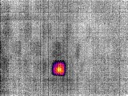
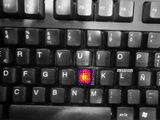
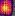

# Solar-panel-fail-detection-demo
Python project in which a Flir thermal camera and a raspberry pi are used to detect and classify potential failures in solar panel cells.

The demo presented tries to immitate a solar panel using a keyboard and its keys, by warming one of the keys and using the thermal camera with the raspberry pi and the program developed, it can detect and extract the potential failure from it.

## Prerequesites

* Flir Camera, in my project I used [this one](https://www.amazon.com/FLIR-Thermal-Imaging-Camera-Android/dp/B07232C9RB)
* Type C to USB adapter
* Raspberry pi and its charger
* Option 1: Another computer to run VNC to work with the raspi remotely
* Option 2: Screen, mouse and keyboard to work with the raspi directly
* Have internet connection to call the models

### Visual recognition and Power AI vision models

* Create a Visual recognition service of IBM (which is for free for some API calls) [here](https://www.ibm.com/watson/services/visual-recognition/)  

* To have a recognitnion model, one example of the pictures that I used for the training are in the "Modelo1" folder. 
* To have a classification model, the labels were used between grey keys(not a match) and color keys(match) captured and cropped by the program

**NOTE: you can make your models following this example from IBM [here](https://github.com/IBM/powerai-vision-object-detection
)**

## Install
* Python must be installed in the raspberry, at least version 2.7

## Deployment

* 1 - Connect the flir camera to the raspberry pi with the USB-Type C adapter
* 2 - Use VNC to connect to the raspberry and show what is catching with the Flir camera or just swtich on the raspi
* 3 - Run the following scripts in order: Flircamera.py > tkinter.py > menu.py
 What we have now is 2 different windows displaying what the thermal camera is catching as we can see below.
 

* 4 - Now, every single time that we press the key "E" will take a screenshot and the models will try to detect and classify the warm key in the keyboard as we can see in the examples down below.

## Examples of usage
This is the data flow in which the program will work, first of all, take the screenshot of what we want to analise pressing E and sending the screenshot to the first model, what we receive is a json with coordenates that we will use to draw yellow windows in the objects detected.

As mentioned before, we mark the detected objects and from each one, we crop the image and send the cropped image to the next classifitacion model.

In the end, what we have is this result in which we can see the normal image with the potential failure pasted on it so we can see it easily.

## Author

* **Álvaro Teruel Cañones** - *Python-Model-detection* - [alteruca](https://github.com/alteruca)
